# System Architecture Diagrams

## High-Level System Architecture

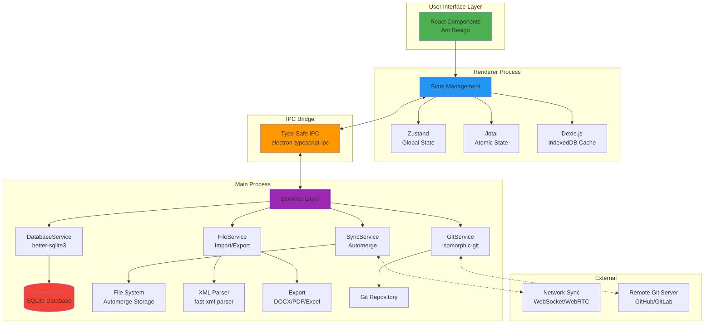

## Data Flow Architecture

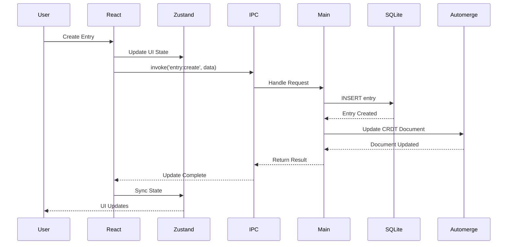

## State Management Architecture

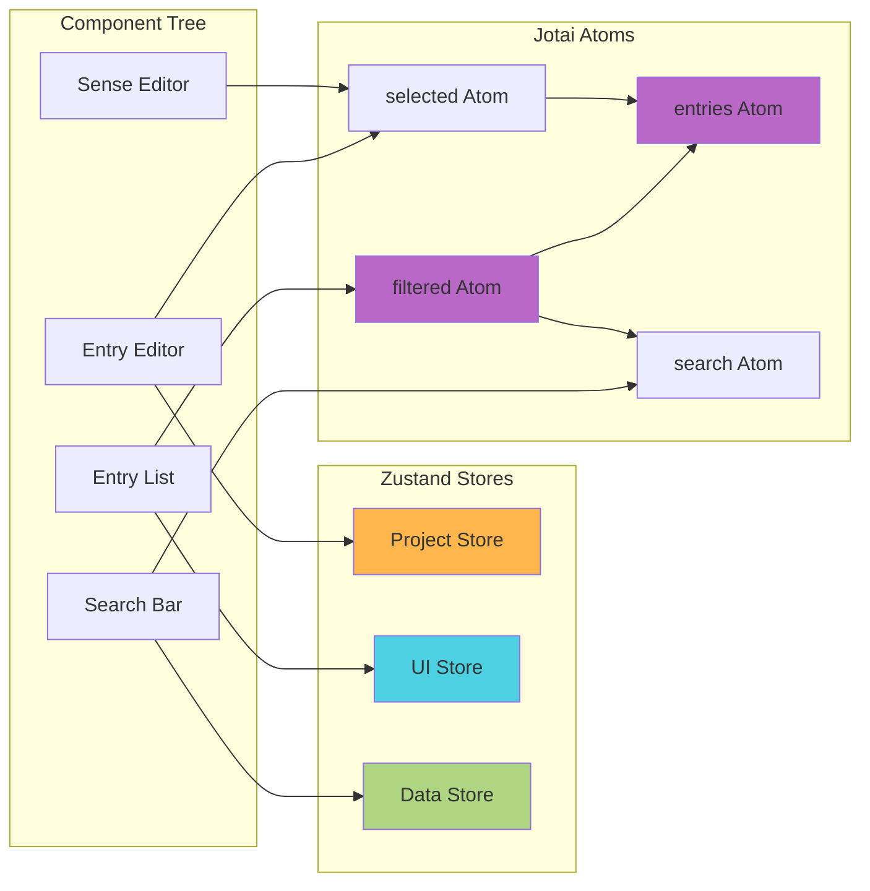

## Database Schema

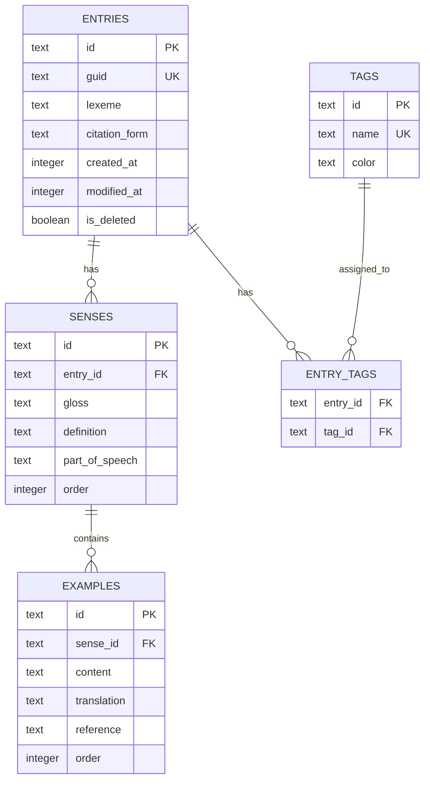

## Sync Architecture (Automerge CRDT)

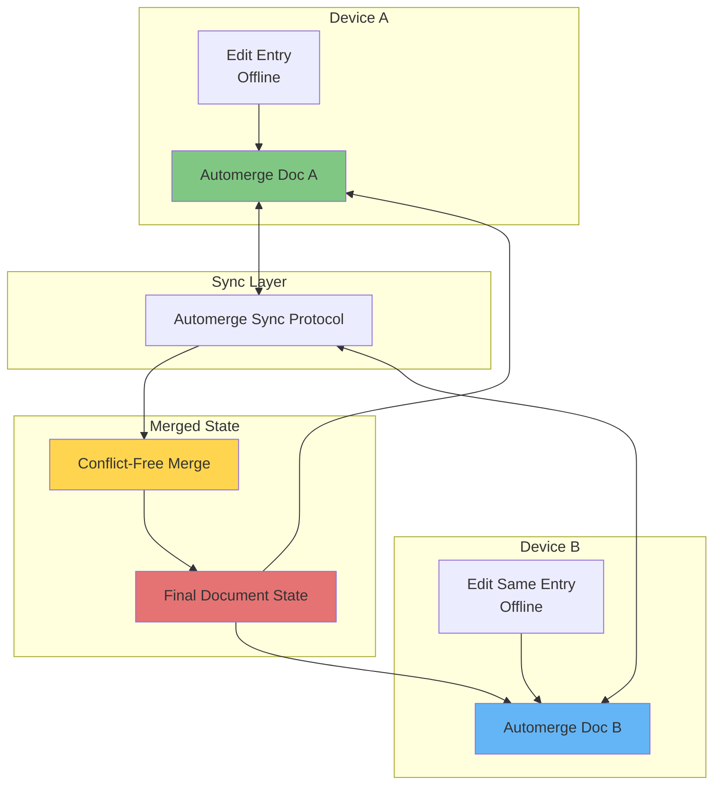

## FWData Import/Export Pipeline

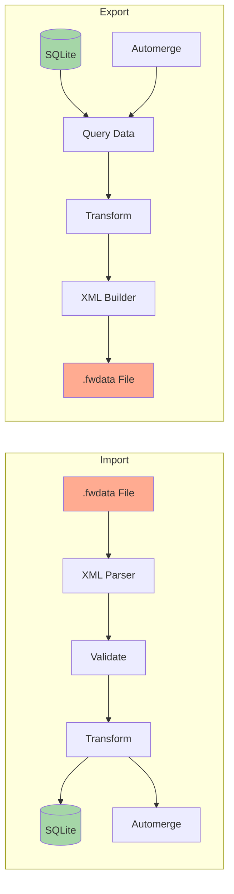

## Export Format Pipeline

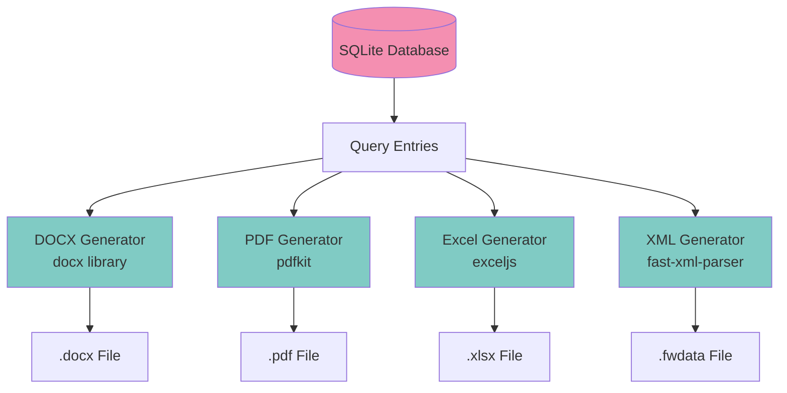

## Component Architecture (Feature-Sliced Design)

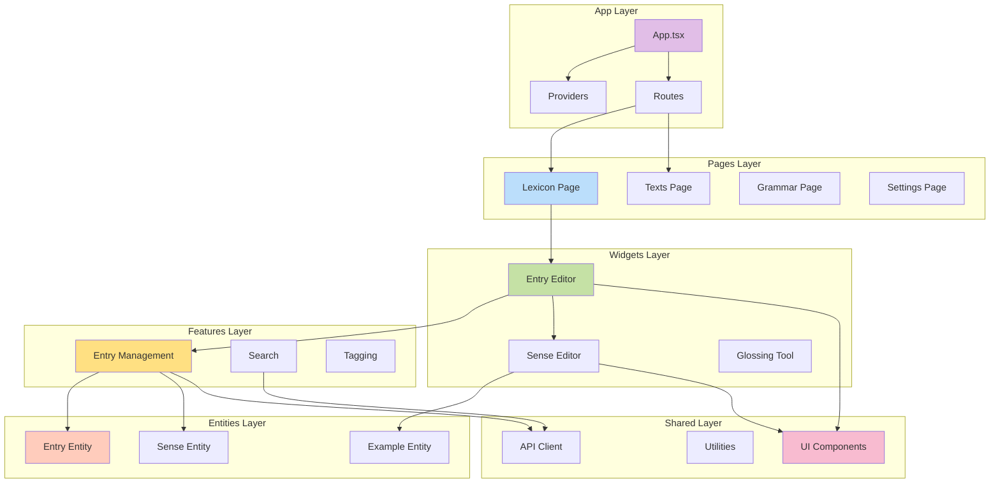

## Security Architecture

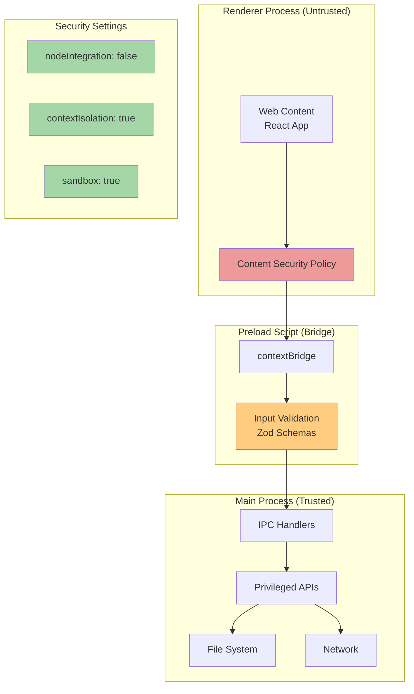

## Offline-First Architecture

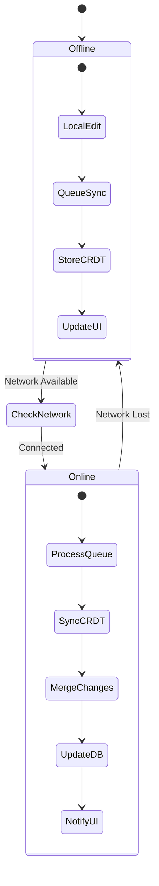

## Build & Distribution Pipeline

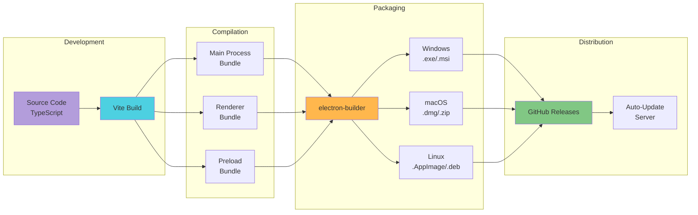

## Testing Strategy

```mermaid
graph TB
    subgraph "Unit Tests (Vitest)"
        UT1[Database Service Tests]
        UT2[Utility Function Tests]
        UT3[Business Logic Tests]
    end

    subgraph "Component Tests (RTL)"
        CT1[Entry List Tests]
        CT2[Editor Tests]
        CT3[Form Tests]
    end

    subgraph "Integration Tests"
        IT1[IPC Communication Tests]
        IT2[Sync Logic Tests]
        IT3[Import/Export Tests]
    end

    subgraph "E2E Tests (Playwright)"
        E2E1[Create Entry Flow]
        E2E2[Search Flow]
        E2E3[Export Flow]
    end

    CODE[Source Code] --> UT1
    CODE --> UT2
    CODE --> UT3

    COMP[Components] --> CT1
    COMP --> CT2
    COMP --> CT3

    SYS[System] --> IT1
    SYS --> IT2
    SYS --> IT3

    APP[Full App] --> E2E1
    APP --> E2E2
    APP --> E2E3

    style UT1 fill:#C5E1A5
    style CT1 fill:#80DEEA
    style IT1 fill:#FFAB91
    style E2E1 fill:#CE93D8
```

## Performance Optimization Strategy

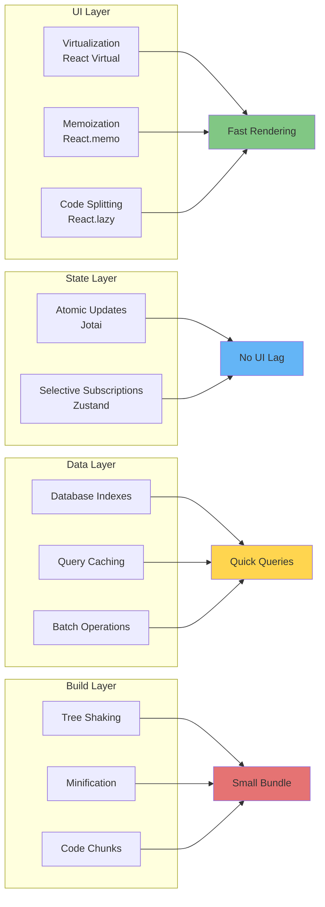

---

## Legend

### Color Coding
- 🟢 Green - Data/Storage Layer
- 🔵 Blue - State Management
- 🟠 Orange - Communication/IPC
- 🟣 Purple - Services/Business Logic
- 🔴 Red - Database
- 🟡 Yellow - Build/Tooling

### Abbreviations
- **IPC** - Inter-Process Communication
- **CRDT** - Conflict-Free Replicated Data Type
- **RTL** - React Testing Library
- **E2E** - End-to-End
- **CSP** - Content Security Policy
- **FSM** - Finite State Machine

---

*For implementation details, see ARCHITECTURE.md and IMPLEMENTATION_GUIDE.md*
